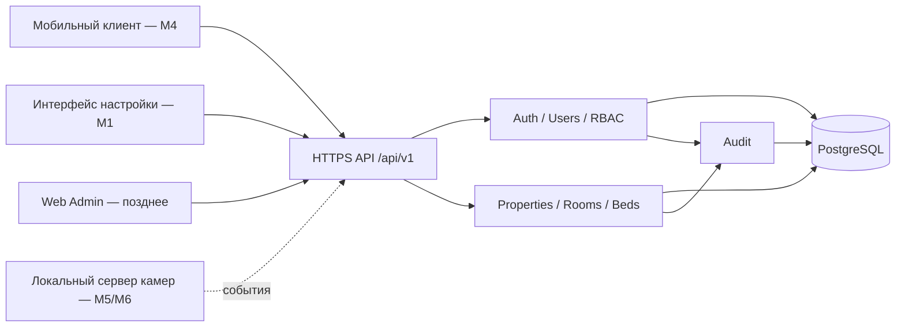
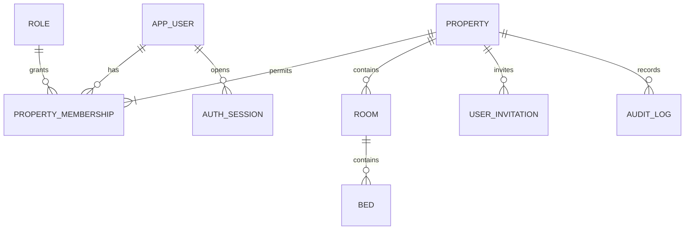

> Исторический проект до начала разработки. Новое ТЗ упростило MVP; действующая реализация и API описаны в [ROUND1.md](ROUND1.md).

# M1 — Foundation

Статус: проект v0.1, 2026-09-25. Основание: предоставленное техническое задание, особенно разделы 36, 42 и 43. Документ фиксирует проектные решения; согласование владельцем и реализация ещё не выполнены.

## 1. Объём и исходные допущения

Текущая поставка — проектирование пользователей, ролей, дома, комнат, мест, аутентификации, API и аудита. Ни заселение, ни финансы, ни камеры в M1 не входят.

Для первого запуска принимаем один дом, русский интерфейс, UZS и часовой пояс Asia/Tashkent. Количество комнат и мест задаётся при настройке; примеры «7 комнат, 59 мест» не являются начальными данными. База начинается без комнат и мест. Модель доступа уже привязана к дому, чтобы позднее добавить второй объект без глобальных прав управляющего.

Телефон — контакт, не обязательный способ входа. Для M1 используем логин и пароль, без SMS-провайдера. Первого владельца создаёт локальная процедура bootstrap; публичной регистрации владельцев нет. Это проектные допущения, которые можно изменить до реализации M1.

## 2. Архитектура

Один модульный backend и PostgreSQL. Разделение модулей внутри приложения, без микросервисов, очередей и Redis в первом этапе. Нагрузка одного дома не требует распределённой архитектуры.

Слои модулей: HTTP/DTO → application service → domain rules → repository. Контроллеры не вычисляют доступ, вместимость или баланс. Общие компоненты: транзакции, requestId, validation, авторизация, ошибки и audit writer. Модули обращаются друг к другу через application services, а не меняют чужие таблицы напрямую.

Язык и framework backend, native/cross-platform технология мобильного приложения и место размещения сервера остаются решениями этапа реализации. API и реляционная модель от них не зависят. Для миграций нужен инструмент выбранного backend; ORM не должен препятствовать индексам и блокировкам PostgreSQL.

По уточнению владельца основной сервер приложения и бизнес-данных — UGREEN DXP4800 Plus, 192.168.1.105. Проект хранится также в GitHub yusuf2205/ijara360 и Gitea mygithub.uz/joseph/ijara360. Точная схема каталогов и публикации описана в [инфраструктуре](INFRASTRUCTURE.md). Видео на последующих этапах хранится локально на NAS; необходимость отдельного AI worker определяется позднее по измеренной нагрузке. Покупка оборудования в M1 не нужна.

## 3. Пользователи и права

`app_users` — учётные записи сотрудников. `property_memberships` связывает пользователя с домом и одной ролью. Будущий `Resident` — отдельная сущность; жилец не получает учётную запись сотрудника автоматически.

Канонических ролей две: `OWNER` и `ADMIN`. SUPER ADMIN и MANAGER из задания — синонимы, не дополнительные роли. OWNER имеет полный прикладной доступ к своему дому, но не доступ к чужим объектам и не право редактировать аудит. Служебный оператор БД не является ролью продукта.

| Операция | OWNER | ADMIN |
|---|---|---|
| Просмотреть доступный дом, комнаты и места | Да | Да |
| Изменить название, адрес дома | Да | Нет |
| Создать, изменить, архивировать комнату | Да | Нет |
| Изменить вместимость и базовую цену места | Да | Нет |
| Создать, архивировать, восстановить место | Да | Нет |
| Пометить свободное место как резерв/ремонт; вернуть в свободные | Да | Да |
| Пригласить сотрудника, изменить роль, отключить доступ к дому | Да | Нет |
| Читать полный аудит дома | Да | Нет |
| Читать историю операций комнат и мест | Да | Да, без данных управления доступом |
| Менять/удалять аудит | Нет | Нет |
| Заселение, выселение, платежи | M2/M3 | M2/M3 |

Каждый запрос проверяет активную сессию, отсутствие глобальной блокировки пользователя, активное членство в запрашиваемом доме и разрешение операции. Идентификатор дома из URL — контекст запроса, а не доказательство доступа. Списки и дочерние сущности фильтруются по нему на backend. Для недоступного объекта возвращать 404, для запрещённой операции в доступном доме — 403.

Роль не берётся из тела запроса, localStorage, произвольного заголовка или клиентских claims. На каждую операцию она читается из БД. Для изменяющих транзакций членство повторно проверяется под блокировкой; отзыв доступа и запись операции имеют определённый порядок, а не гонку между проверкой и сохранением.

У дома должен оставаться хотя бы один активный OWNER. Изменения состава владельцев сериализуются блокировкой строки дома. Нельзя отключить/понизить последнего владельца. Новый OWNER сначала принимает приглашение как ADMIN, затем действующий OWNER повышает его роль. Глобальное отключение пользователя служебным оператором также не должно оставить дом без владельца.

## 4. Auth и жизненный цикл доступа

- Bootstrap запускается оператором один раз под транзакционной advisory lock: создаёт пользователя, дом, членство OWNER и audit. Повторный запуск ничего не перезаписывает. Секрет вводится интерактивно, не через аргумент shell и не хранится в репозитории.
- Владелец создаёт приглашение для **нового** логина, срок действия 24 часа. Система возвращает случайный одноразовый код только в этом ответе; владелец передаёт его сотруднику самостоятельно. Автоматических сообщений в M1 нет.
- При принятии приглашения сотрудник задаёт собственный пароль. Под блокировкой invitation проверяются срок, отсутствие отзыва и активные полномочия создателя; user + membership ADMIN + audit создаются атомарно. Повторное принятие — 409. Существующий логин — 409; добавление существующего аккаунта в другой дом отложено.
- Пароль: 15–128 символов без искусственных требований к составу. Хеш Argon2id, отдельная соль на пароль; параметры подбираются нагрузочным тестом, начальная нижняя граница — 19 MiB, 2 итерации, parallelism 1. Проверять распространённые пароли по локальному списку. Пароли не обрезать.
- Оpaque session token: 32 случайных байта, криптографический генератор. В БД только SHA-256 digest токена. Абсолютный срок — 7 суток, простой — 24 часа; истечение любого срока требует входа. Это выбранные параметры продукта, а не значения по умолчанию библиотеки.
- В браузере — `Secure`, `HttpOnly`, `SameSite=Lax` cookie, HTTPS, проверка Origin и CSRF token на изменяющих запросах. Native-клиент — Bearer token в защищённом хранилище ОС. Одновременная cookie/Bearer аутентификация отклоняется. Browser-вариант не возвращает токен в JSON.
- Смена пароля требует текущий пароль и отзывает все сессии. Для приглашений и управления правами нужен повторный ввод пароля, если `authenticated_at` старше 10 минут; это обновляет именно время повторной аутентификации.
- Logout отзывает текущую сессию немедленно. Отключение членства немедленно закрывает доступ к дому, другие членства не меняет. Глобальная блокировка пользователя и истечение сессии проверяются на каждом запросе.
- Восстановление потерянного доступа в M1 — служебная локальная процедура с проверкой личности оператором, отзывом сессий и записью события. Публичный endpoint сброса без подтверждённого канала доставки не вводится.
- Начальная политика rate limit: вход — 5 неудач на логин и 20 попыток на IP за 15 минут; принятие приглашения — 10 попыток/IP за 15 минут; остальные запросы — 120/мин на сессию. Параметры конфигурируемы. Счётчики общие для всех процессов, атомарные, без постоянной блокировки аккаунта. В M1 допустим PostgreSQL store с очисткой истёкших окон.
- Ответ входа одинаковый для неизвестного логина и неправильного пароля; выполнять dummy password verification для неизвестного логина. Не включать токены, пароли и коды приглашений в access logs, crash reports или audit.

## 5. Доменная модель

| Сущность | Назначение и существенные поля |
|---|---|
| Role | Фиксированные коды OWNER, ADMIN; матрица разрешений в backend |
| AppUser | UUID, login, fullName, contactPhone, passwordHash, disabledAt |
| PropertyMembership | propertyId + userId, roleCode, active, version |
| Property | UUID, name, address, timezone, currency, version |
| Room | UUID, propertyId, number, capacity, archivedAt, version |
| Bed | UUID, propertyId, roomId, placeNumber, monthlyPrice, availabilityState, stateNote, archivedAt, version |
| AuthSession | digest токена, userId, authenticatedAt, lastSeenAt, абсолютный срок, revokedAt |
| UserInvitation | propertyId, login, tokenHash, expiresAt, acceptedAt/revokedAt, createdBy |
| AuditLog | actor, action, entityType/id, before/after, reason, timestamp, requestId |
| IdempotencyRequest | userId, propertyId, key, requestHash, результат, expiresAt |
| AuthRateLimit | digest ключа лимита, начало/конец окна, счётчик |

UUID не несёт бизнес-смысла. Номера комнат и мест — строки до 20 символов, допускают «3-А», нормализуются trim + единый регистр до записи. Уникальность номера комнаты — в доме, места — в комнате, включая архив. Для повторного использования номера восстанавливается исходная сущность; история не разделяется между двумя UUID одного физического места.

`placeNumber` — локальный номер, например `1`. Отображаемое обозначение `3-1` строится из номера комнаты и места. UUID остаётся неизменным при переименовании. Перенос существующего места между комнатами в M1 запрещён; это отдельный будущий сценарий с сохранением истории.

Цена — `numeric(14,2)`, не float. API передаёт её десятичной строкой, например `"900000.00"`; валюта дома UZS. Значение неотрицательное. Это базовая цена предложения, а не начисление, оплата или договорная цена будущего жильца. Изменение базовой цены в M1 не создаёт финансовых операций.

Даты событий — timestamptz, API — RFC 3339 UTC. Границы календарного дня и будущие расчётные даты определяются timezone дома. Валюта и timezone в M1 фиксируются при bootstrap; изменение после начала финансового учёта требует отдельного решения.

## 6. Статусы и вычисления

Публичные статусы места строго: AVAILABLE, OCCUPIED, RESERVED, MAINTENANCE. Архивирование — отдельное поле, не пятый статус.

| Статус | Источник | Поведение M1 |
|---|---|---|
| AVAILABLE / Свободно | operational state | Можно резервировать, закрыть на ремонт, архивировать |
| RESERVED / Резерв | operational state + обязательная причина | Ручной временный резерв, без жильца и автоматического срока; можно освободить |
| MAINTENANCE / На ремонте | operational state + обязательная причина | Можно вернуть в свободные |
| OCCUPIED / Занято | Активный Occupancy, начиная с M2 | Не выставляется вручную и в M1 не возвращается |

Физически Bed хранит только `availability_state ∈ {AVAILABLE, RESERVED, MAINTENANCE}`. Публичное `status` в M1 равно этому значению. В M2 оно станет `OCCUPIED`, если есть активный период проживания, иначе — availability_state. Поэтому нет двух независимых источников «занятости». Статус RESERVED в M1 означает ручную отметку, а не договор бронирования.

Разрешённые ручные переходы: AVAILABLE ↔ RESERVED и AVAILABLE ↔ MAINTENANCE. Между резервом и ремонтом — через освобождение. Повтор той же команды не создаёт повторного события при совпадающем idempotency key. Произвольный переход и OCCUPIED — 422. В M2 любое изменение operational state занятого места будет 409.

Статусы жильца ACTIVE, PLANNED_MOVE_OUT, MOVED_OUT, BLOCKED и платёжные PAID, PARTIAL, DUE_SOON, OVERDUE зарезервированы в документации следующих этапов; таблиц и enum для них сейчас нет.

Вместимость комнаты — физический лимит, а количество мест — число заведённых неархивных Bed. `count(active beds) <= room.capacity`. AVAILABLE, RESERVED и MAINTENANCE одинаково занимают физическую вместимость. Несозданные места не показываются как свободные. Полезно отдельно показать «настроено 7 из 9».

Сводка M1: активные комнаты, настроенные места, свободные, резерв, ремонт. Все числа строятся одним согласованным SQL snapshot по неархивным комнатам/местам. `totalBeds = availableBeds + reservedBeds + maintenanceBeds` в M1. Никаких отдельных изменяемых счётчиков в Property/Room.

Количество жильцов, долг, фактический доход, заселения и присутствующие физически люди в M1 **неизвестны**, а не равны нулю. Эти поля отсутствуют в API. Даже в M2 «проживает по учёту» нельзя подписывать «сейчас внутри». Оценка присутствия — отдельный будущий показатель с качеством данных и временем последнего обновления.

## 7. Транзакции и ограничения

В [SQL-проекте](schema/m1-design.sql) реализованы только декларативные ограничения. До production нужны сервисы/DB procedures, описанные ниже, и реальные тесты PostgreSQL. Один `CHECK` не может надёжно проверять число строк другой таблицы; для операций со вместимостью проект предусматривает блокировки. См. [PostgreSQL constraints](https://www.postgresql.org/docs/current/ddl-constraints.html) и [row locks](https://www.postgresql.org/docs/current/explicit-locking.html).

Общий порядок блокировок для команд одного дома: Property → actor Membership → target Membership при необходимости → Room → Bed. UUID нескольких объектов сортируются. Проверить права после взятия блокировок. В M1 блокировка дома сериализует изменения одного объекта недвижимости; для 50–60 мест это приемлемый простой выбор. Запросы чтения не блокируются. Позднее можно уменьшить гранулярность без изменения контракта API.

**Создание/восстановление места:** begin → заблокировать дом, членство и комнату → проверить доступ, активность комнаты, If-Match и уникальность → посчитать неархивные места → если достигнут capacity, вернуть 409 → записать Bed → увеличить версии Bed/Room → записать AuditLog → сохранить idempotency result → commit. Rollback откатывает всё. Восстановление выполняется по тому же правилу, что создание.

**Изменение вместимости:** тот же lock protocol; нельзя установить capacity ниже числа активных мест. Override в M1 отсутствует. Превышение физического лимита нельзя разрешить общим флагом из клиента. Если такой сценарий понадобится позднее, он потребует отдельного OWNER-only change request и физического места, но никогда второго активного Occupancy на одном Bed.

**Архивирование:** место можно архивировать только из AVAILABLE; комната — только когда все её места уже архивированы. Никаких каскадных скрытых архивирований. Восстановление комнаты не восстанавливает её места автоматически. В M2 добавится обязательная проверка отсутствия активного проживания. Дом в M1 не архивируется. DELETE endpoints для бизнес-данных отсутствуют.

**Конкурентное редактирование:** version начинается с 1 и растёт на каждое изменение; `If-Match: "<version>"` обязателен. Устаревшая версия — 412. Это дополняет блокировки, защищая от затирания чужих правок. Смена состояния/цены/архива места также увеличивает Room.version, чтобы агрегированная карточка комнаты имела актуальный ETag.

**Идемпотентность:** для команд inventory и memberships используется UUID Idempotency-Key. Уникальность `(actor, property, key)`, hash метода + пути + canonical body + If-Match. После повторной проверки доступа найденный завершённый запрос возвращает тот же результат; другой hash — 409. Запись ключа, изменение и audit — одна транзакция, TTL 24 часа. Конкурирующий запрос ожидает завершения первого. Не записывать секреты auth/invitation в эту таблицу; эти endpoints имеют отдельную одноразовую/отзывную семантику.

Версии, audit и проверки вместимости не обеспечены одним SQL-файлом. При реализации рекомендуется DB procedures для inventory, вызываемые backend: runtime-роль получает EXECUTE, не прямой INSERT/UPDATE этих таблиц. Тогда тот же протокол нельзя случайно обойти другим repository. Владелец схемы — отдельная migration-role. Декларативные FK/UNIQUE/CHECK остаются последним уровнем защиты данных.

## 8. Audit foundation

События M1: USER_BOOTSTRAPPED, INVITATION_CREATED/REVOKED/ACCEPTED, MEMBERSHIP_ROLE_CHANGED/ACTIVATED/DEACTIVATED, PROPERTY_UPDATED, ROOM_CREATED/UPDATED/ARCHIVED/RESTORED, BED_CREATED/UPDATED/STATE_CHANGED/ARCHIVED/RESTORED. Auth-события: LOGIN_SUCCEEDED/FAILED, LOGOUT, PASSWORD_CHANGED, ACCESS_RECOVERED, SESSION_REVOKED, REAUTH_SUCCEEDED/FAILED.

Для успешного изменения бизнес-данных audit записывается в **той же транзакции**. Если insert audit не прошёл — изменения не фиксируются. Для неудачного входа/отклонённого доступа отдельная короткая транзакция security audit: нечего откатывать вместе с бизнес-командой. Аудит безопасности не выдаётся ADMIN через историю места.

Поля: UUID, propertyId (null только для глобальных auth-событий), actorUserId (null для неизвестного/системного действия), actorKind USER/SYSTEM/ANONYMOUS, action, entityType, entityId, before/after JSON, reason, occurredAt сервера, requestId. Системный actor требует reason. Для внешнего API actor всегда определяется аутентификацией, не DTO.

Before/after — allowlist изменённых бизнес-полей. Пароль, passwordHash, session/invitation token и их digest, CSRF secret никогда не включаются. Для создания before=null, для архива before/after содержат archivedAt. Неизвестный login в security audit хранится как keyed digest, не как ввод пользователя. Логи не содержат документов и фотографий.

Audit append-only: runtime не имеет UPDATE, DELETE, TRUNCATE; добавляется защитный trigger на UPDATE/DELETE, владелец таблицы отделён от приложения. DBA технически может изменить данные — это не криптографическое доказательство неизменности. Ежедневные отдельные резервные копии и мониторинг служебных действий уменьшают этот риск.

Бизнес-история и audit не очищаются обычной TTL-задачей. Сессии, rate limits и idempotency — технические данные с отдельной очисткой. Сроки хранения персональных данных и будущих видео согласуются перед эксплуатацией; фиксированный юридический срок здесь не утверждается.

## 9. Эксплуатация

HTTPS на reverse proxy, PostgreSQL недоступен из интернета. Секреты задаются окружением/secret store, не репозиторием. Отдельные роли БД для migrations, runtime и backup. Trusted proxy список явный; rate limiting не доверяет произвольному X-Forwarded-For. Ошибки API не раскрывают SQL/stack trace. Логи структурированы по requestId, health endpoints не раскрывают конфигурацию.

Ежедневный `pg_dump -Fc`, шифрованная копия вне основного диска/сервера, минимум 7 ежедневных и 4 еженедельных версий. Отдельно сохранять конфигурацию развёртывания и секреты в защищённом хранилище. Предлагаемые цели: RPO ≤ 24 часа, RTO ≤ 4 часа; это цели для проверки, не достигнутые гарантии. При более строгом RPO добавить WAL/PITR отдельным решением.

Перед первым релизом и ежемесячно: восстановить копию в изолированный PostgreSQL, проверить FK, количество комнат/мест, контрольные записи audit и вход тестовой учётной записи; зафиксировать длительность и результат. В восстановленной среде заблокировать внешние интеграции и отозвать восстановленные сессии/приглашения. См. [PostgreSQL backup/restore](https://www.postgresql.org/docs/current/backup-dump.html).

Мониторинг M1: доступность API/БД, ошибки транзакций, auth abuse, возраст последнего успешного backup, свободный диск. Алерт о backup старше 26 часов. Доставка операторских алертов выбирается при развёртывании.

## 10. Границы расширения

| Этап | Новые сущности/ответственность | Что сохраняется |
|---|---|---|
| M2 | Resident, Occupancy, история проживания | UUID Bed, scope дома, audit, роли |
| M3 | Charge, Payment, PaymentAllocation, DepositLedger, корректировки | Цены точные, backend источник финансов |
| M4 | Мобильный dashboard и основные потоки | Один API и бизнес-логика |
| M5 | Camera, CameraEvent, ссылки на локальные snapshot/clip | Отдельные credentials edge, проверка доступа к медиа |
| M6 | Detection, tracking, IN/OUT, review | AI не меняет проживание/финансы |
| M7 | Оценка присутствия, ночной отчёт | Явное качество/неопределённость данных |

M2 должна атомарно связать жильца и Bed через Occupancy. Обязательны unique partial indexes по bedId и residentId для открытого периода (`ended_at IS NULL`) и проверка пересечения исторических интервалов, если разрешён ввод задним числом. Подробное проектирование этих таблиц относится к M2. См. [PostgreSQL partial indexes](https://www.postgresql.org/docs/current/indexes-partial.html).

M3 не хранит `paid=true`: начисления, распределения платежей и исправления отдельными проводками. Депозит отделён от дохода. Отрицательный обычный Payment запрещён, возвраты и исправления имеют свой тип/ссылку/причину. Перед M3 определить пропорцию неполного месяца, день 29–31, досрочный выезд, аванс, округление и распределение платежа. Эти правила не выдумываются в M1.

M5/M6: trackingId ограничен камерой/сессией трекера, не является постоянной личностью. Без идентификации нельзя достоверно утверждать, что это тот же посетитель в разные дни; повторяемость — гипотеза для ручной проверки. Классификации UNKNOWN/RESIDENT/GUEST/IGNORE подтверждает человек. Камеры только в допустимых общих зонах, видео локально; события не блокируют доступ, не выселяют и не начисляют штрафы.

Guests, Notifications, Utilities, Requests, Reports предусмотрены как отдельные будущие модули без пустых таблиц и неработающих пунктов меню M1. Face recognition не является зависимостью ни одного этапа текущего foundation.

## 11. Источники решений безопасности

Выбранные TTL, роли и сценарии — решения этого проекта. Принципы минимальных прав и проверки каждого запроса сверены с [OWASP Authorization](https://cheatsheetseries.owasp.org/cheatsheets/Authorization_Cheat_Sheet.html), хранение сессий — с [OWASP Session Management](https://cheatsheetseries.owasp.org/cheatsheets/Session_Management_Cheat_Sheet.html), паролей — с [OWASP Password Storage](https://cheatsheetseries.owasp.org/cheatsheets/Password_Storage_Cheat_Sheet.html). Ссылки проверены 2026-09-25; версии зависимостей и параметры развёртывания нужно закрепить при реализации.
